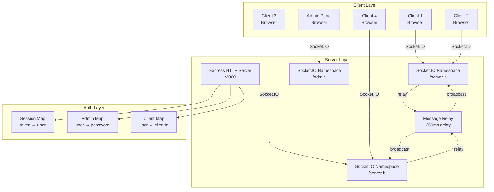
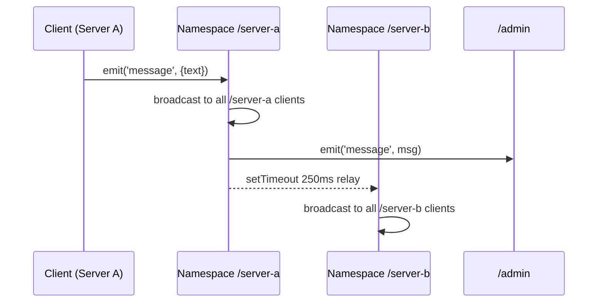

# ARCHITECTURE.md

## System Overview

## Module Description

| Module | File | Үүрэг |
|--------|------|-------|
| HTTP Server | server.js | Express app, static file serve |
| Auth API | server.js `/api/*` | Login, register, logout, admin CRUD |
| Socket Relay | server.js `attachServer()` | Message relay between namespaces |
| Admin Namespace | server.js `/admin` | Real-time stats, server toggle, kick |
| Frontend Client | public/client.html + client.js | Chat UI, socket connection |
| Frontend Admin | public/index.html + app.js | Admin dashboard |

## Data Flow

## Layer Description
- **Client Layer**: Browser-based UI, no framework, Socket.IO client
- **Server Layer**: Single Node.js process, multiple Socket.IO namespaces
- **Auth Layer**: In-memory Maps (no DB), token-based admin sessions
